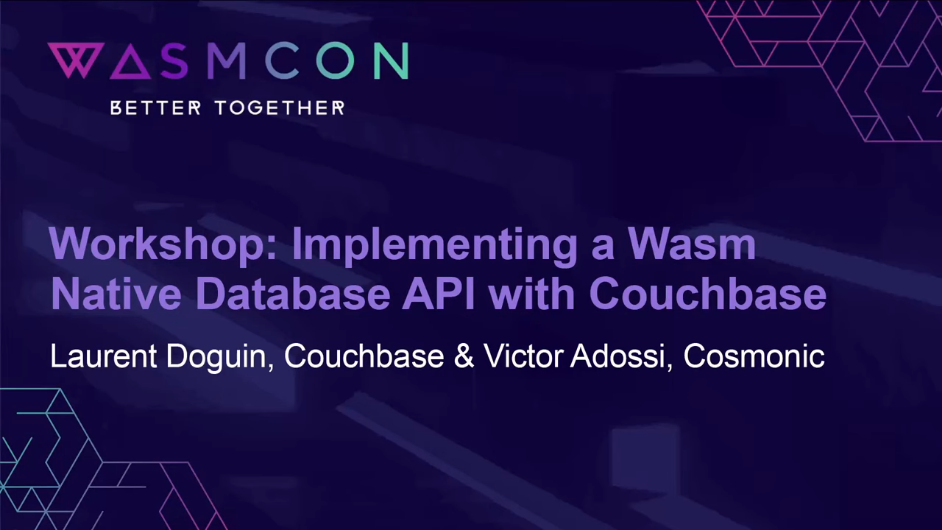

# 🛋 WASMCON 2024: Implementing a Wasm Native Database API with Couchbase

Presented by [Couchbase][couchbase] and [Cosmonic][cosmonic] maintainers.

[](https://www.youtube.com/watch?v=Cc5FcP8rMQ0&list=PLbzoR-pLrL6o0UD4PoO0H_RnoToEiWBIS&index=37&ab_channel=TheLinuxFoundation)

### [📽️ Get the slides](https://docs.google.com/presentation/d/1KOmK13DK9rA7rHA37pbFNxVi2jCkNIhrJkUmK5evW84)

### [🗓️ View Sched.com Event](https://wasmcon24.sched.com/event/ceac3a35d773d3c7498156218db7e22e)

This repository contains everything you need to get started with the workshop:

[cosmonic]: https://cosmonic.com/
[couchbase]: https://couchbase.com/

## 👷 Workshop

In this workshop, we'll be building **NuBase**, an experimental new database with an HTTP API,
powered by Couchbase.

By the end of the workshop, we will:

- Examine the HTTP & Couchbase native WebAssembly Interface Type ("WIT") interfaces
- Build a HTTP API [WebAssembly-native database component][wasmcloud-docs-component], powered by [Couchbase][couchbase]
- Run your database implementation locally with [wasmCloud][wasmcloud]

[wasmcloud-docs-component]: https://wasmcloud.com/docs/concepts/components
[wasmCloud]: https://wasmcloud.com

## 📂 Organization

Here's a run-down of the files in this repository:

| Folder            | Description                                                           |
|-------------------|-----------------------------------------------------------------------|
| `wit`             | WIT definitions we'll be using during the talk                        |
| `nubase`          | Code for the Database component we'll finish as part of this workshop |

## 🌎 Environment setup

### GitPod

[](https://gitpod.io/#https://github.com/vados-cosmonic/wasmcon2024-couchbase-workshop)

If using [GitPod][gitpod], you can launch `.gitpod.yml` file in this repository, and make an account at GitPod.io if necessary to get into an environment that "just works"!

[gitpod]: https://gitpod.io

### Devcontainers

To use [GitHub devcontainers][devcontainers] to run this project, you can run

```console
just start-devcontainer
```

> [!NOTE]
> If you prefer to *not* use [`just`][just], run `devcontainer up --workspace-folder .`
>
> See [`Justfile`](./Justfile) for more recipes and the commands they run.

[devcontainers]: https://github.com/devcontainers/cli

### Manual/Local

To run manually, ensure that you have the following tools installed:

| Dependency                 | Description                                               | Easy install method                            |
|----------------------------|-----------------------------------------------------------|------------------------------------------------|
| [`just`][just]             | Task runner (similar to GNU `make`)                       | `cargo install just`                           |
| [`wash`][wash]             | WAsmcloud SHell - a tool for managing wasmCloud instances | `cargo install wash-cli`                       |
| [`wit-deps`][wit-deps]     | Manual downloading of WIT interfaces                      | `cargo install wit-deps-cli`                   |
| [`wasm-tools`][wasm-tools] | WebAssembly toolkit (used during code generation)         | `cargo install wasm-tools`                      |
| [`tinygo`][tinygo]         | [TinyGo][tinygo] toolchain                                | [`tingyo` install guide][tinygo-install-guide] |
| [`go`][go]                 | [Go][go] toolchain                                        | [`go` install guide][go-install-guide]         |

[just]: https://github.com/casey/just
[wash]: https://wasmcloud.com/docs/installation
[tinygo]: https://tinygo.org/
[go]: https://go.dev/
[wit-deps]: https://github.com/bytecodealliance/wit-deps
[wasm-tools]: https://github.com/bytecodealliance/wasm-tools
[tinygo-install-guide]: https://tinygo.org/getting-started/install/
[go-install-guide]: https://go.dev/learn/

You can easily check which tools are not installed by running:

```console
just check
```

Once you have all required tools installed, you can build the project by running:

```console
just build
```

Then, start Couchbase, using `docker compose`:

```console
just start-couchbase
```

From here, you can start developing the component:

```console
just dev
```
